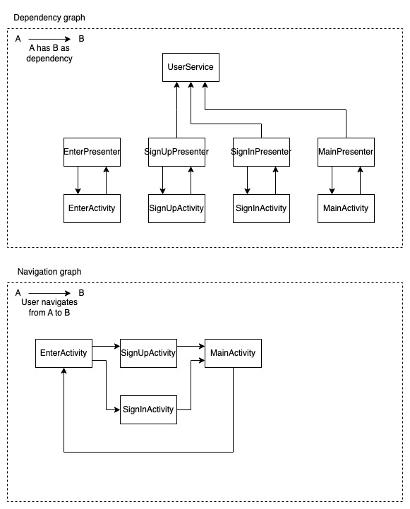

# Authorization app

This is a simple app that uses the authorization code flow to authenticate a user. As remote service to authenticate the user,
this app uses the [UserService](UserService.kt) class.



## Activity

This app consists of four activities:

- `EnterActivity` - The first activity that the user sees. It consists of two buttons, one to sign in and one to sign up. Each
  button takes the user to the appropriate activity.
- `SignUpActivity` - The activity that the user sees when they click the sign up button. It consists of a form with an email,
  password, confirm password fields and sign up button. The user can click the sign up button to sign up. After signing up, open
  MainActivity.
- `SignInActivity` - The activity that the user sees when they click the sign in button. It consists of a form with an email
  and password fields and sign in button. The user can click the sign in button to sign in. After signing in, open MainActivity.
- `MainActivity` - The activity that the user sees after signing in or signing up. It consists of a text "Entered as
  {User.name}" and button to sign out. The user can click the sign out button to sign out. After signing out, open
  EnterActivity.

## MVP

Each screen has a corresponding Presenter and View. The Presenter is responsible for handling the business logic and the View is
responsible for displaying the UI.

Hard mode: Instead of using Presenter and Activity instances use interfaces for them. For example:

```kotlin
object Main {
    interface View {
        fun showUser(user: User)
        fun navigateToEnterActivity()
    }
    interface Presenter {
        fun onViewInit()
        fun onSignOutClicked()
    }
}

class MainPresenter(private val view: Main.View) : Main.Presenter
class MainActivity : AppCompatActivity(), Main.View {
    private lateinit var presenter: Main.Presenter
}
```

## Reactive programming

App uses reactive programming with RxKotlin. All subscriptions should be made in the Presenter, in the subscribe() method
presenter should call appropriate methods of view. For example:

```kotlin
class Presenter(private val someDependency: SomeDependency) {
    fun someFunction() {
        someDependency.callRxMethod()
            .subscribe(
                { result -> view.showResult(result) },
                { error -> view.showError(error) }
            )
    }
}
```

Something new:

- Read about navigation between activities in Android using Intent
- Read about TextInputLayout, TextInputEditText and whats the difference between them and EditText

Note:

- There is no requirements about design, so you can use any design you want, but try to make it good looking. Let all screens be
  consistent, e.g. all buttons should have the same size and color, all text fields should have the same size and color, etc.
- For inputs use TextInputLayout and TextInputEditText, also set error message for TextInputLayout, e.g. if password is wrong -
  show this error right in password field using error message.
- For navigation presenter should call view.navigateTo{ScreenName}() method and view should implement NavigateTo{ScreenName}
  method with Intents